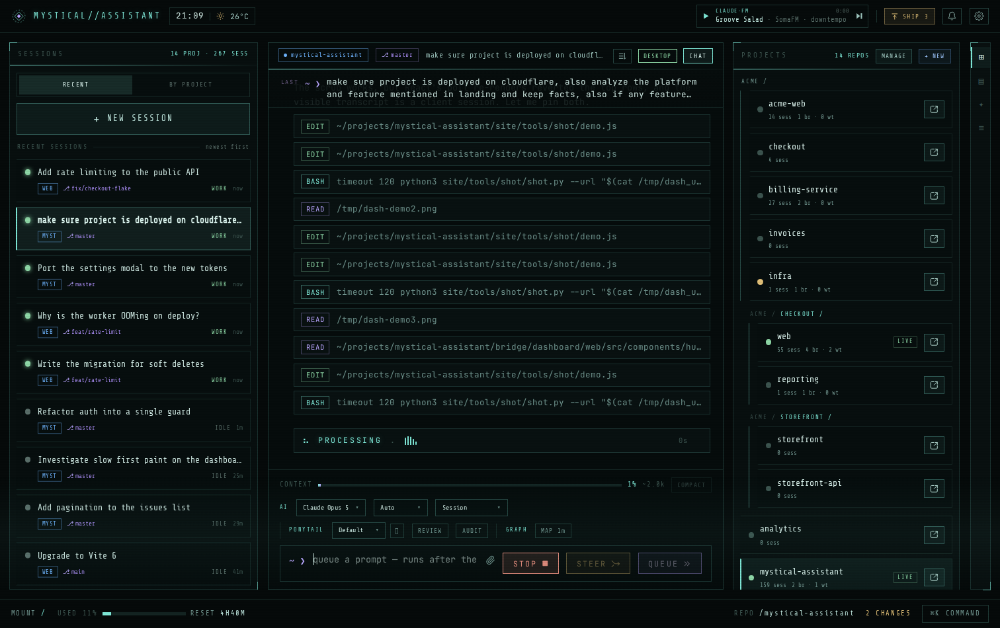
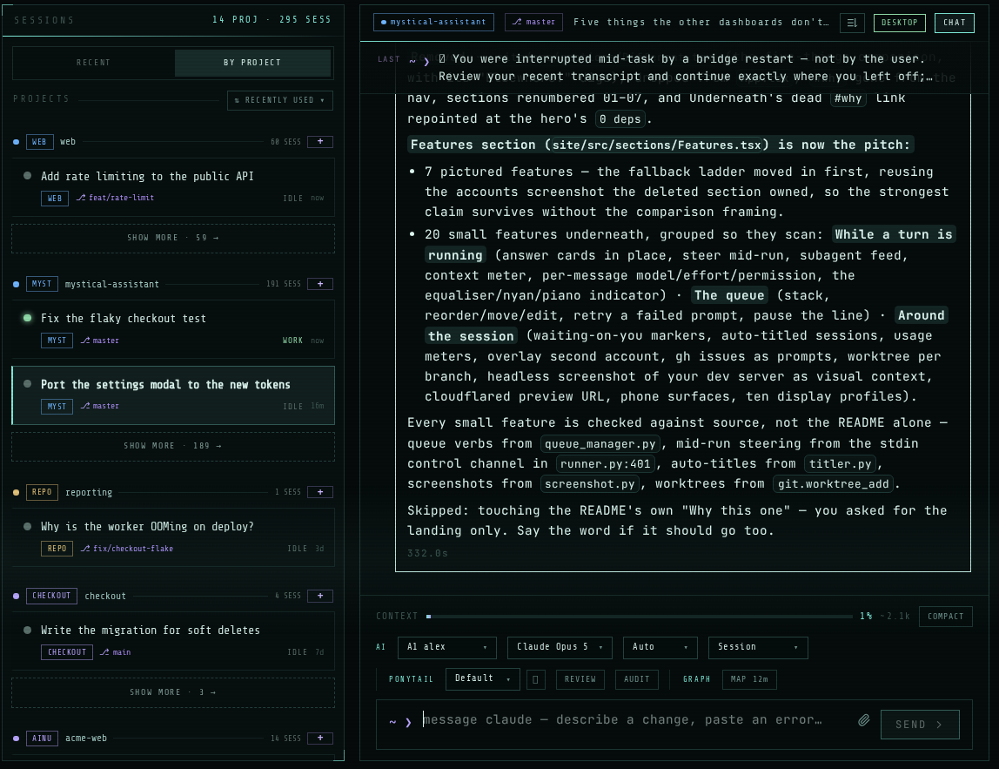
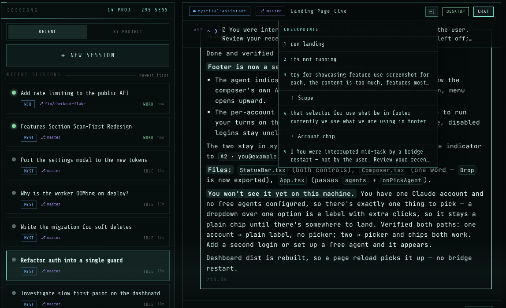
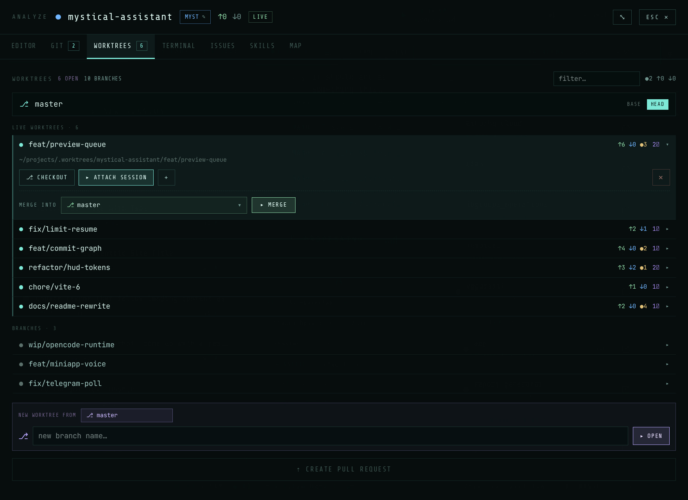
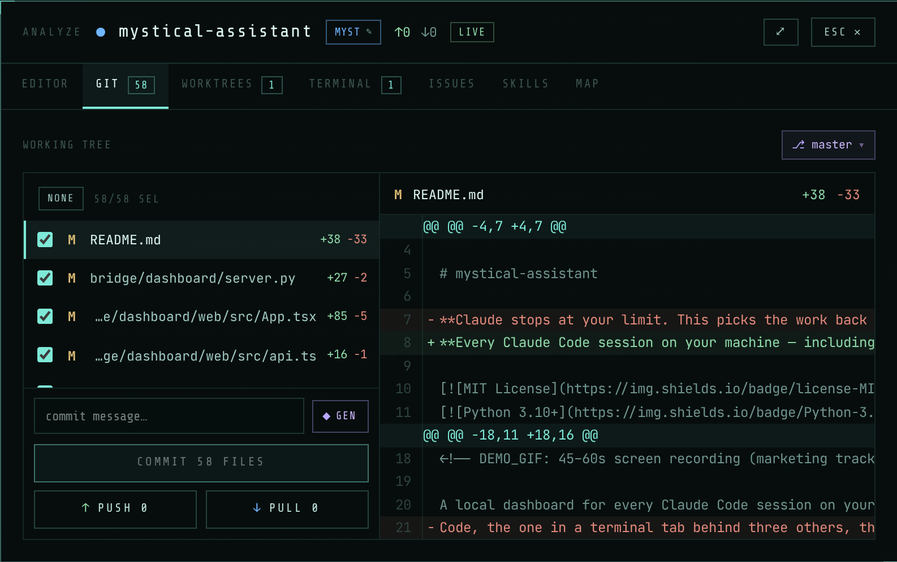
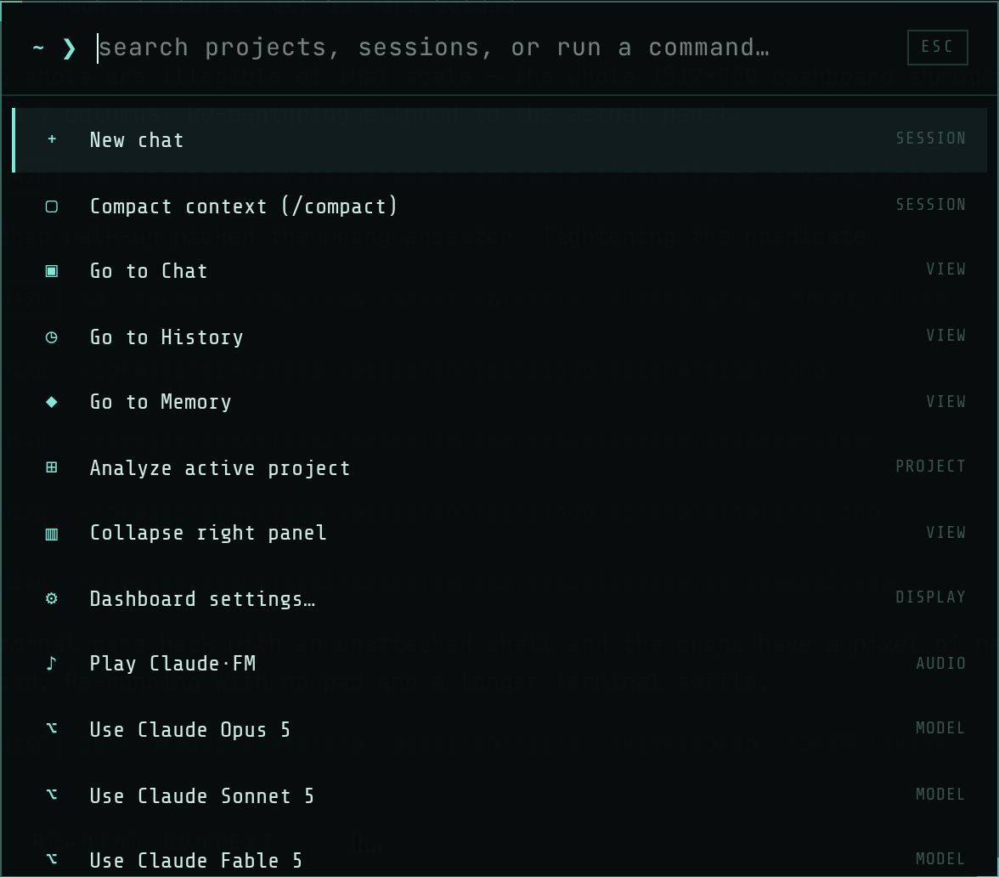
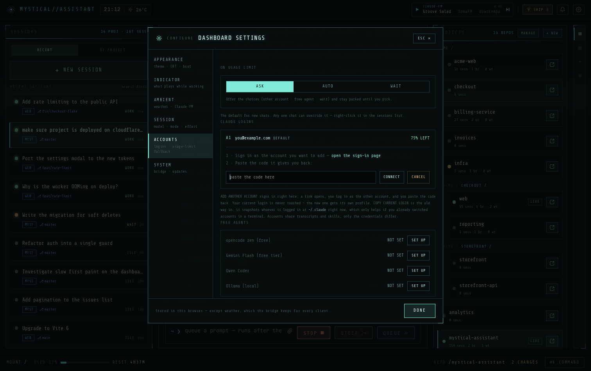
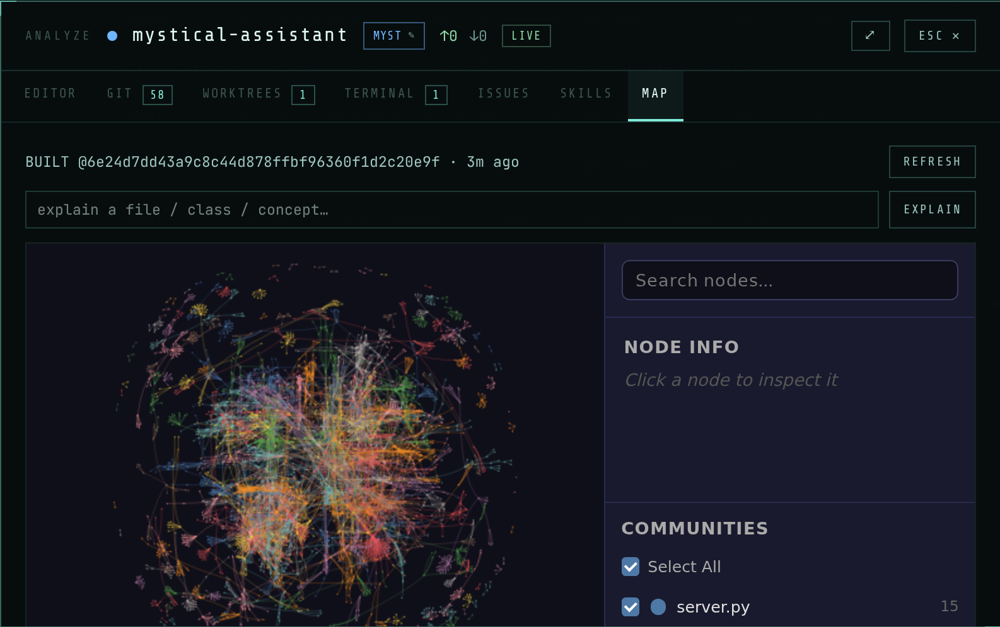
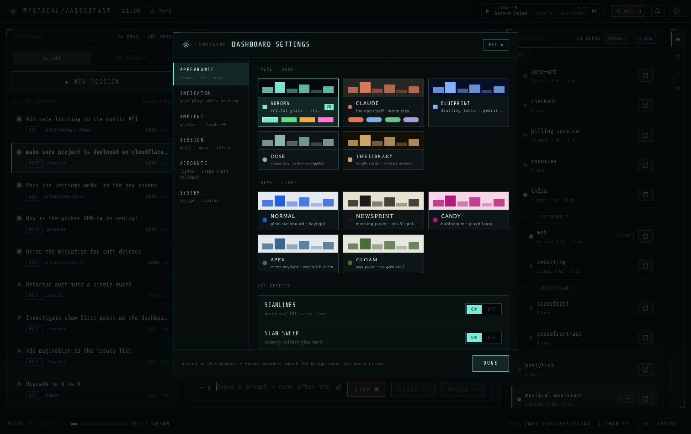

<div align="center">


# mystical-assistant

**Every Claude Code session on your machine, including the ones you started somewhere else.**

[](LICENSE)
[](https://www.python.org/)
[](#)
[](https://claude.com/claude-code)

[mystical-assistant.pages.dev](https://mystical-assistant.pages.dev)

</div>

<!-- DEMO_GIF: 45–60s screen recording (marketing track) goes here -->

## You're running six Claude Code sessions. You can see one.

The one in VS Code. The one you left in a repo last Tuesday. Claude Code will run
all of them and never tell you they exist.

This reads Claude Code's own session registry and puts every session on one page,
grouped by repo, marked alive or not. Open one, answer it, carry it on from your
desk or your phone, without reopening the project it came from.

When a usage limit kills a turn, it parks the session and finds another way on:
another Claude account of yours, a free agent on a different provider, or the
reset itself.

The bridge runs `claude` locally and reuses its login, so there's no API key.
Your phone or browser is a remote control; the work happens on your machine, in
your repos.

| | |
|---|---|
| **0** deps | on the server. Python standard library, end to end. |
| **1** page | for every session, wherever you started it. |
| **3** ways on | when a limit lands, before the work is lost. |
| **12** panes | editor, git, terminal, issues, map, skills. |

**MIT licensed** · **no API key** · **no account** · **no telemetry** ·
**macOS, Linux, WSL**

```bash
git clone https://github.com/ainurdev/mystical-assistant
cd mystical-assistant && ./setup.sh
```

Six questions, and it reads the sessions you've already got, so there's something
to see a minute after it starts. [The whole of setup is below.](#-04--setup)



<br />

## ✦ 01 · In the box

**Every one of these started as something missing.**

The eight numbered below are why you'd install it. The rest are why it stays open
all day. No plans, no free tier, no paid one.

### 1. Every session, and where

Grouped by repo, live or idle, with anything waiting on an answer flagged.
Nothing hides in a terminal tab you closed. Liveness comes from Claude Code's own
registry, one file per process, checked against the OS: a VS Code session shows
as running because the process is running.

> *Elsewhere: where a session is listed at all it's dated by its transcript's
> mtime, which goes stale and lies about long, quiet turns. And no editor
> extension lists the sessions running outside it.*



### 2. You know the second one needs you

Every row carries its own state — WORK, WAIT, LIVE, IDLE, DONE — so the one
stopped on a question or an approval says so, in a list you already have open.
Telegram pings you with which session it was, whether or not you're at the
dashboard.

<!-- SHOT: site/public/shots/states.png — the session rail with rows in different states -->

### 3. Skim a session in seconds

Checkpoints list every prompt, every question it asked and every mid-run steer.
Jump to one instead of scrolling an hour of transcript.



### 4. Two features at once

Branch into its own worktree from here, with session, diff and shell already
pointed at it. No stashing, no second clone.



### 5. The project, not just the chat

Diff, editor, terminal, issues and a map of the repo, beside the session that's
changing them. Read the hunks, write the commit, push.



### 6. ⌘K and you're there

New chat, compact, switch model, jump between chat and history. It all
runs on localhost, so nothing waits on a server.



### 7. Limits park the turn

Hit a 5-hour or weekly cap and the work is parked, not lost. Parking is the
floor: it walks a ladder of another Claude account you own, a free agent on a
different provider, then the real reset time read off the usage endpoint. Then it
picks the turn back up, context intact. Each session decides whether it asks
first or just switches. Server errors take their own path, the first retry
immediate and each repeat longer, out to thirty minutes. All of it survives a
restart.

Extra logins live in their own `CLAUDE_CONFIG_DIR` as thin overlays: that
account's credentials are a real file, and everything else (transcripts, skills,
plugins, settings) symlinks back to your `~/.claude`. Your existing login is
never redirected, and because the transcripts stay shared, any account can
`--resume` any session.

> *Elsewhere: shell wrappers watching the terminal from outside, and account
> switchers that swap one global credential file, changing the account under
> every session already running.*



### 8. It maps your repo

Subsystems, hub files and how they connect, read off tree-sitter ASTs. No
embedding bill.



### The rest

**While a turn is running**

| | |
|---|---|
| Answer it without stopping it | Permission cards, acted on in place |
| Steer mid-run | Fold a correction into the live turn |
| See the subagents | A live feed per agent, read-only |
| Watch the context fill | Per cent, tokens, `/compact` one tap away |
| Per-message controls | Model, effort, permission posture |
| Something to watch | Equaliser, nyan cat, a playable piano |

**The queue**

| | |
|---|---|
| Stack the next prompts | They run in order, unattended |
| Reorder before they run | Bump, move, edit or drop |
| Retry what failed | One tap, no retyping |
| Pause the line | Hold it after the running turn |

**Around the session**

| | |
|---|---|
| Sessions name themselves | Auto-titled, not a wall of UUIDs |
| It remembers the repo | Keep or skip what it learned, scoped to project and branch |
| Usage in plain sight | Live 5-hour and 7-day meters, per account |
| A second account | Overlay profile, first login untouched |
| Issues become prompts | Through the `gh` CLI you already authorised |
| Skills, per repo | Plus a catalog to add more from |
| A real terminal | xterm.js on the session's own worktree |
| It can look at the page | A headless shot of your dev server |
| The same session on your phone | A Telegram bot and Mini App |
| Ten display profiles | Light, dark, CRT scanlines |

<br />

## ✦ 02 · The workspace

**Everything you'd go looking for is already open.**

It runs on localhost and is never published. Point it at the folder your repos
live in and it picks up the sessions already there. Nothing to migrate, nothing
to re-create, and something to show you a minute after it starts.

**Sessions, grouped by repo.** Every session keyed to the project it belongs to,
so a repo's whole history sits in one place: turn counts, cost, which models ran,
when it was last touched. No more guessing which of nine was the one.

**One list of what's alive.** Read from Claude Code's own session registry and
checked against the running process, so liveness is exact rather than a guess
from file timestamps. VS Code, terminal, or started here: they all show up the
same way.

Everything the workspace opens:

`CHAT` · `HISTORY` · `PROJECTS` · `FILES` · `QUEUE` · `EDITOR` ·
`GIT` · `WORKTREES` · `TERMINAL` · `ISSUES` · `SKILLS` · `MAP`

**Four surfaces, one session store.** A session started on any of them continues
on any other. The run never leaves your machine, and there's no app to install.

| Surface | Where | What for |
|---|---|---|
| **Desktop dashboard** | `127.0.0.1:8790` | Where the work happens. Localhost only, never published. |
| **Telegram Mini App** | bot menu → 🛠 Open Panel | The same panel, off your machine. Prompts, screenshots, live stream, answer cards. |
| **Telegram bot** | DM your bot | Quick plain-text prompts when a full panel is more than you need. |
| **Native Claude Code** | the `claude` you already run | Found on its own, and resumable from the three above. |



Dark and light, from plain daylight to newsprint to a drafting table, with the
CRT effects on their own switches. You'll stare at it all day. It may as well
look like something you chose.

<br />

## ✦ 03 · What's underneath

**The editor is CodeMirror. The terminal is xterm.js.**

No pane here is a homemade version of a tool you already use. Where a good one
exists, that's the one running. Where the work belongs on your machine, it's your
`git`, your `gh` and your `claude` login doing it.

| Pane | What's actually running |
|---|---|
| **EDITOR** | **CodeMirror 6.** Selection, folding and keymaps behave as they do everywhere else CodeMirror runs; JS, TS, Python, HTML, CSS, JSON and Markdown ship with it |
| **TERMINAL** | **xterm.js** in front of a real PTY. Curses apps and colour work because it's a terminal, not a command box |
| **GIT · WORKTREES** | **your git**, invoked the way you'd invoke it. Nothing is modelled twice, so nothing drifts |
| **ISSUES** | **the `gh` CLI**, under the auth you already granted it. No second token to mint |
| **MAP** | **graphify.** Repo structure from tree-sitter ASTs, with no LLM pass and no embedding bill |
| **SKILLS** | **community `SKILL.md`.** Installing one downloads the maintained original from GitHub, verbatim |
| **THE ENGINE** | **`claude`.** The CLI you already logged into, reading the transcripts it already writes. No API key, no wrapper between you and the model |
| **FALLBACK** | **opencode.** The open-source CLI itself, run headless on a free provider. Not a second route into your subscription |

This is the other side of the *dependencies: 0* badge. The server needs nothing
installed **because** the work goes to tools already on your machine. Nothing
reimplemented, nothing bundled. (The browser UI is a normal Vite app, built once
on first start.)

<br />

## ✦ 04 · Setup

**Two minutes, and it has something to show you.** Nothing gets migrated: it reads
the sessions already on your machine.

| You need | Why | Note |
|---|---|---|
| [`claude` CLI](https://claude.com/claude-code), installed and logged in | the bridge shells out to it | reuses your existing login, no API key |
| Python 3.10+ | runs the bridge | stdlib only, nothing to `pip install` |
| `npm` | builds the dashboard UI on first start | only the build; nothing Node runs at runtime |
| A Telegram account | phone control, and setup asks for a bot token | see the note below |

A small tunnel client (only for the phone Mini App) and `opencode` (only for the
free-provider fallback) are optional. Setup offers to install both.

> **On the bot token:** the project began as a Telegram bridge and `setup.sh`
> still requires a token even though the dashboard doesn't use one. Making it
> optional for a dashboard-only install is on the list; until then, a throwaway
> bot takes about a minute and nothing will message it.

```bash
git clone https://github.com/ainurdev/mystical-assistant
cd mystical-assistant
./setup.sh
```

`setup.sh` asks six questions and handles the rest. It checks what it needs
before it changes anything, and a second pass only asks for what's still missing.

1. **Bot token.** It walks you through [@BotFather](https://t.me/BotFather) →
   `/newbot` → paste the token. Setup checks the token against Telegram and
   prints your bot's `t.me` link, so a typo fails here instead of at first run.
   A new token also gets the mystical logo set as the bot's profile picture.
2. **Projects root.** The folder your repos live in (default `~/projects`).
3. **Permission posture.** Whether sessions you start from the dashboard or phone
   ask before running commands (default) or run with full autonomy. There is no
   silent default: it decides what Claude may do on your machine unwatched.
4. **Mini App?** The phone control panel. It needs a small tunnel client, and if
   that's missing setup offers to install it (Homebrew on macOS, a release binary
   into `~/.local/bin` on Linux). Say no and you still get the bot and dashboard.
5. **Free-provider fallback?** Offers to install `opencode` (~60MB), which lets a
   session hand off to a non-Anthropic model when your Claude accounts run out of
   quota. Add the provider key later in the dashboard.
6. **Start it now?** Launches the bridge.

The rest runs itself: it captures your Telegram chat id (it asks you to message
the bot, then reads the id off that message), generates the dashboard token,
links `mystical` onto your `PATH`, and offers to add `~/.local/bin` to your shell
rc if it isn't there. No web bundle is committed, so setup builds the dashboard,
Mini App and landing page at the end (`mystical build` redoes it any time, and
`mystical` start rebuilds whatever went stale). That step needs `npm` and takes
a minute longer.

Then open the dashboard URL setup prints at the end.

**Day to day**

```
mystical            start in the background (logs → ~/.bridge_state/mystical.log)
mystical stop       graceful stop
mystical restart    stop, then start
mystical status     running? + ports, dashboard URL, public link
mystical doctor     check prerequisites
mystical logs       follow the log
mystical run        run in the foreground (Ctrl-C to quit)
```

**If something's off**

| Symptom | Fix |
|---|---|
| `mystical: command not found` | open a new shell, or `export PATH="$HOME/.local/bin:$PATH"` |
| `claude not found` from `mystical doctor` | install the CLI and run `claude` once to log in |
| Setup said "No message received in time" | re-run `./setup.sh`, it resumes at the chat-id step |
| Bot ignores you | your chat id isn't in `ALLOWED_CHAT_IDS`; check `mystical logs` |
| No 🛠 Open Panel button | `MINIAPP_ENABLE="0"` in `.env`, or the tunnel client is missing |
| Port already in use | set `DASH_PORT` / `MINIAPP_PORT` in `.env`, then `mystical restart` |

**Config**

- **Config lives in `.env`** (git-ignored, `chmod 600`; `setup.sh` writes it).
  `.env.example` documents every option. Required: `TELEGRAM_BOT_TOKEN`,
  `BASE_PATH`, `ALLOWED_CHAT_IDS`.
- **Dashboard only, no tunnel:** set `MINIAPP_ENABLE="0"`.
- **Stable Mini App URL:** the panel gets a throwaway tunnel hostname by
  default, which changes on every restart. For a fixed one, provision a named
  tunnel and set `PREVIEW_HOSTNAME` / `TUNNEL_NAME` / `TUNNEL_ID` /
  `TUNNEL_CREDENTIALS_FILE`.
- **Rebuild the web UI** (only if you change the frontend):
  `npm --prefix bridge/miniapp/web ci && npm --prefix bridge/miniapp/web run build`
  (same for `bridge/dashboard/web`).
- **Chat-id discovery mode:** start `mystical` with `ALLOWED_CHAT_IDS` empty,
  message the bot, and copy the id it prints. Setup only; never leave it empty
  otherwise.

<br />

## ✦ 05 · The honest part

**A thing on your machine that runs commands.** Worth knowing what you're
installing. No telemetry, no account, and the whole server is a few thousand
lines of standard-library Python you can read yourself.

Whoever is in `ALLOWED_CHAT_IDS` can run Claude Code and start dev servers on
this machine. With `--dangerously-skip-permissions` that is arbitrary command
execution. That's the point of the tool and also the risk: Claude Code runs with
your user's permissions in your own repos, so anything that can slip a prompt
past you runs as you too.

- **It never leaves localhost.** The dashboard binds `127.0.0.1` and is never
  published. A Host allow-list blocks DNS rebinding and `DASH_TOKEN` blocks CSRF,
  so a page you happen to have open in another tab can't drive it.
- **Keep `ALLOWED_CHAT_IDS` locked** to your own chat id(s). Never leave it empty
  in production; discovery mode is for setup only.
- **Treat `TELEGRAM_BOT_TOKEN` as a secret.** It also signs Mini App `initData`.
  It lives in `.env`, which is git-ignored. Keep it `chmod 600`.
- **The Mini App server binds `127.0.0.1`** and is reachable only through the
  tunnel. Unauthenticated requests get 401 (signed `initData` required).
- **Read-only where it counts.** The parts that watch your existing sessions only
  read. Subagent views derive from files Claude Code already wrote, and never
  touch a live run.
- **`RUN_TIMEOUT` caps a single Claude run.** The session auto-resumes afterwards,
  so the brake on a runaway is the resume cap (5 consecutive dead turns), not the
  clock.

Your code stays on your machine and there's no telemetry. One caveat: the
auto-title and new-session-relevance checks each run a cheap Haiku pass
through your CLI after a turn, so they send that turn's output to Anthropic in a
second call. Small, but not free on your quota. Each is one env var away from off:

```
TITLE_ENABLE=0       # no auto-titling
RELEVANCE_CHECK=0    # no "should this be a new session?" check
```

See the SECURITY section at the bottom of `claude_telegram_bridge.py` before
exposing this.

<br />

## ✦ 06 · Questions

**The things people ask first.** If yours isn't here,
[open an issue](https://github.com/ainurdev/mystical-assistant/issues). That's the
fastest way to get it answered.

<details>
<summary><b>Do I need an Anthropic API key?</b></summary>

No. It shells out to the `claude` CLI already on your machine and reuses the login
you set up the first time you ran it. There's no key to paste anywhere, and no
account to make here.

</details>

<details>
<summary><b>What does it install?</b></summary>

Nothing to `pip install`: the server is Python 3.10+ standard library only. The
dashboard UI is a Vite app the bridge builds on first start, so you do need `npm`
on the machine; after that it rebuilds only when the sources change.

</details>

<details>
<summary><b>Does it work with the Claude Code I already run in VS Code?</b></summary>

That's the main point of it. Sessions under your projects folder are read from
Claude Code's own transcripts, and liveness comes from its session registry checked
against the real process. A VS Code or terminal session shows as running because it
is, not because a file looked recent. Continue one and it carries on from there.

</details>

<details>
<summary><b>What actually happens when I hit a usage limit?</b></summary>

The session gets parked rather than dropped, then it looks for a way to keep going:
another Claude account of yours with quota left, a free agent on a different
provider, or failing both, the reset itself. It reads the reset time from the usage
endpoint, waits, and resumes the turn with its context intact. You set whether it
asks first, switches on its own, or only ever waits, per session or as the default.
Server errors (500, 529, and the 429 that isn't a usage limit) take a separate path:
the first retry is immediate and each repeat waits longer, out to thirty minutes.
All of it is persisted, so restarting the bridge mid-wait doesn't lose it.

</details>

<details>
<summary><b>Can it use a second Claude account?</b></summary>

Yes, if you have one. Add it from the dashboard's Accounts tab: a sign-in link
opens, you log in as that account, you paste the code back. Each account lives in
its own profile directory, so the login you already had is never touched, and every
turn is still the real `claude` binary spawned per run with that profile. Nothing
proxies or pools tokens. When a limit hits, the account with the most quota left
goes first, and its meter sits next to the others in that tab.

</details>

<details>
<summary><b>Can I drive it from my phone without Telegram?</b></summary>

Not yet. Remote control today goes through Telegram: the bot for quick prompts, the
Mini App for the full panel. The dashboard never leaves localhost by design. A
signed-in web surface you can reach from anywhere is the plan; until it lands,
off-machine access means Telegram.

</details>

<details>
<summary><b>What does it cost?</b></summary>

Nothing to buy. It's MIT licensed and it drives the Claude Code you already pay for.
What it costs lands on your quota rather than your wallet, and your live 5-hour and
7-day usage sits on screen so you can watch it.

</details>

<details>
<summary><b>Which operating systems work?</b></summary>

macOS and Linux, including WSL.

</details>

<br />

## ✦ 07 · Architecture

- **`claude_telegram_bridge.py`**: entry point; wires the package together and
  runs the Telegram long-poll loop.
- **`bridge/`**: the implementation.
  - `store.py`: SQLite source of truth, `sessions → turns → events`. One row per
    conversation, keyed by owner + project, carrying the native `claude_session_id`
    used for `--resume`. The single store is shared by the bot, Mini App, and dashboard.
  - `runner.py`: invokes the `claude` CLI (blocking for the bot, streaming
    stream-json for the chat clients); resolves each run's session, cwd, and
    permission mode; journals events to the store + pub/sub.
  - `native.py`: discovers native Claude Code sessions under `BASE_PATH` and
    indexes them into the store.
  - `transcript_jsonl.py`: translates Claude's native `.jsonl` transcripts into the
    bridge's `{turns, events}` shape so native sessions render with full fidelity.
  - `machine.py`: machine-wide view of live external Claude Code sessions.
  - `limits.py`, `ladder.py`, `accounts.py`, `freeagent.py`: the parking and
    fallback path. Usage-limit detection, the ask/auto/wait policy, per-account
    profile directories, and the opencode hand-off.
  - `dashboard/`, `miniapp/`: the two HTTP servers + their React clients (`web/`).
  - `tunnel.py`, `devserver.py`, `usage.py`, `browser.py`, `state.py`, `pubsub.py`.
- **`site/`**: the public landing page (standalone Vite app, no runtime tie to
  the bridge).

Design specs live in [docs/superpowers/specs/](docs/superpowers/specs/), including
the [fallback ladder design](docs/superpowers/specs/2026-07-30-fallback-ladder-design.md).

<br />

<div align="center">

## Stop hunting for the window it's in.

One clone and one script. If you don't like it, it's a folder you can delete.
Nothing was migrated and nothing was signed up for.

```bash
git clone https://github.com/ainurdev/mystical-assistant
cd mystical-assistant && ./setup.sh
```

[mystical-assistant.pages.dev](https://mystical-assistant.pages.dev) ·
[Issues](https://github.com/ainurdev/mystical-assistant/issues) ·
[MIT License](LICENSE)

</div>

---

Free and open source under the MIT License, and not affiliated with Anthropic.
Claude and Claude Code are their trademarks. You bring your own; this just gives
you a longer cable.
